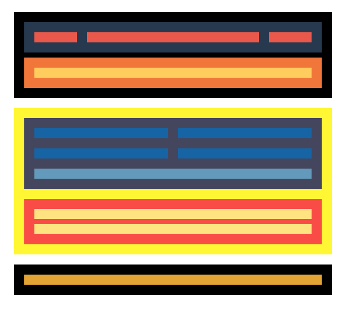

## Enunciat primer lliurament especialització

Marca com a feta

## Descripció

En aquesta pràctica hauràs de fer un *Layout* que ha de funcionar tant en escriptori, com mòbil i tauleta.  

Tingues en compte les següents consideracions. Són errors habituals en els lliuraments:  

- En general, mai li posem height a una capa, sinó que deixem que la capa s'adapti al seu contingut (si la capa no té contingut, li pots posar un height).

- La pàgina no hauria de tenir barra de scroll horitzontal (si et passa, hauràs d'esbrinar inspeccionant la pàgina quin bloc és més ample que la pantalla del navegador).  

- Dins d'un div sol haver-hi altres divs. Els divs tenen display:block per defecte. Això fa que es vagin col·locant de manera vertical. Per tant, sovint no és necessari especificar els següents estils per a un element per ser una cosa redundant:  
  .element{ display:flex; flex-direction:column }

- En un div, per defecte l'ample és de la totalitat de la capa que embolica, així que normalment no serà necessari especificar width:100%

#### Lliurament per GitHub

- Crea un **únic repositori de GitHub** per als tres nivells, els podràs separar en carpetes.  
  Per exemple: nivell-1, nivell-2 i nivell-3.  

- En els dos primers sprints hauràs de pujar el codi a GitHub perquè pugui veure'l el teu mentor/a.  
  A partir de l'sprint 3 hauràs de lliurar-lo via *pull request*, tal com es fa en una empresa.

-  Si no tens clar del tot com pujar el teu projecte a git, al final d'aquest enunciat hi ha un "**Annex I: Pujar el teu codi a git**" amb les passes que has de seguir.  

---

## Nivell 1

### - Exercici 1

A partir del wireframe que t'aportem en format .png, hauràs de fer la maquetació en format escriptori. És indiferent els colors escollits, però sí que és molt important que facis l'estructura de caixes que t'indiquem.

 **Important**

L'ample màxim de la capa que contindrà tota la maquetació serà de 1200px (max-width:1200px).

### - Exercici 2

S'ha de començar a preparar l'adaptació a diferents dispositius, i per això has de tenir clar el concepte de **Media Query**. Fixa't que hi ha canvi de distribució i color d'alguns elements.

 **Per saber més**

Sobre Media Query **-> [Responsive Web Design - Media Queries](https://www.w3schools.com/css/css_rwd_mediaqueries.asp)**

Seguint amb el projecte anterior, fes la versió per tauleta, tal com indica la captura següent:

  

### - Exercici 3

Com el cas anterior, ara hauràs de fer l'adaptació a versió Mobile.

---

## Nivell 2

COMPTE! **abans de passar al nivell 2 verifica que has entès bé tots els exercicis del nivell 1**. 

El nivell 2 i 3 són opcionals, l'important és aprendre els conceptes de cada sprint. Si l'has copiat ràpid d'internet no té valor, ja que si passes així tots els sprints, hauràs treballat molt i après poc. 

En una entrevista tècnica a una empresa o en proves de nivell de l'especialització (després de l'sprint 5 i 9) es detecta molt ràpid aquests casos. No retardis el teu aprenentatge, **millor fer pocs exercicis bé que molts ràpids.**

#### Referència pels exercicis 4 i 5

A continuació tens una mostra de com quedaria la maquetació final de la pàgina.

  

En **->[aquest enllaç](https://itacademy.barcelonactiva.cat/pluginfile.php/16133/mod_page/content/2/images.zip)** et pots descarregar els recursos necessaris.

### - Exercici 4

En aquesta part volem que treballis la capçalera i el grafisme. Hauràs d'afegir icones i logotip, a més de fer una imatge de fons. Substitueix els quadrants respectius perquè la nova capçalera tingui l'aspecte d'aquest web de turisme al japó:

  

És important que tinguis en consideració el següent:

- Les opcions clicables han de tenir efecte *roll-over.*
- Els media query creats a l'activitat anterior, s'han de mantenir.
- El text "Disfruta..." és semitransparent.
- El logo i el fons de la capçalera, els tens adjuntats a l'activitat. La resta d'elements gràfics els hauràs de cercar i que siguin tan semblants com sigui possible.
- Les icones del menú pots obtenir-les de **->[font-awesome](https://fontawesome.com/)**.

### - Exercici 5

En aquest exercici hauràs d'afegir l'apartat dels articles seguint aquest grafisme:

  

---

## Nivell 3

### - Exercici 6

ENHORABONA! Has creat una web completa, però com pots observar, és molt estàtica. Per millorar l'experiència d'usuari, aplica sobre els elements principals de la web, títol i logo, una animació usant **keyframes**.

 **Per saber més**

Tens un exemple molt senzill a partir del minut 22 **-> [d'aquest vídeo](https://www.youtube.com/watch?v=Cg1c6sy8Btk&t=34s)**.

### - Exercici 7

Et veus capaç de fer el mateix treball però amb grid layout? Doncs l'objectiu d'aquest treball és que utilitzis les propietats de grid layout per fer tota l'estructura de la web i els seus diferents dispositius (sempre amb Media Query).

Si vols pots consultar el material **opcional** de grid layout que hi ha al campus.

---

## Annex I: Pujar el teu codi a git

Per a poder lliurar el teu exercici a través de git, segueix els següents passos:

- Executa "**git init"** a la terminal situada a la carpeta a la qual vulguis crear el teu projecte. Això inicialitzarà la carpeta/repositori que tens al teu ordinador local.

(si no saps com obrir el terminal a la carpeta de la teva màquina consulta aquest article, per a**-> [windows](http://www.falconmasters.com/offtopic/como-utilizar-consola-de-windows/)** i **->[mac](https://www.solvetic.com/tutoriales/article/6463-como-abrir-terminal-con-una-carpeta-especifica-en-mac-os/)**)

- Executa "**git add."** a la terminal. Això farà un seguiment dels canvis realitzats a la carpeta del teu sistema des de l'últim commit. Com és la primera vegada que fas commit als continguts de la carpeta, s'afegiran tots.

- Executa "**git commit -m** **nom-del-commit**". Això prepararà els canvis afegits/rastrejats a la carpeta del teu sistema per a empènyer a Github. Pots reemplaçar nom-del-commit amb qualsevol missatge de confirmació rellevant de la teva elecció.

- Executa "**git remote add origin https://github.com/nomdeusuari/repositori.git**" a la terminal. Aquí, nomdeusuari i repositori seran reemplaçats pels valors del teu repositori. 

Ho podràs obtenir fàcilment. Has d'anar a la pàgina principal del teu repositori creat i seguir els següents passos:  

1. Clicar en el botó verd "Clone or download", la qual cosa farà que és desplegi la informació addicional.  
2. Copiar la url que apareix en el desplegable o clicar el botó que et faciliten, la qual cosa farà que es copiï la url en el portapapers del teu ordinador.

  

- Executa "**git remote -v**". En executar aquest comando, es mostra la informació del repositori remot al qual està connectat el teu projecte local. Per tant, haurà d'aparèixer la url del repositori remot que has creat en GitHub.

- Finalment, executa "**git push origin màster**" per a empènyer els teus arxius a Github. Tingues en compte que l'última paraula en el comando màster, no és una entrada fixa quan s'executa git push, pot ser reemplaçada per qualsevol “nom_de_branca” rellevant.

- Verifica al teu repositori de GitHub que s'ha pujat el codi.  

- Còpia la url del repositori i enganxa-la  al lliurament del campus virtual, perquè el mentor/a sàpiga on està el teu codi.

---

## Recordatoris

- Els sprints duren dues setmanes i comencen en dilluns.

- **És obligatori pujar tots els lliuraments almenys amb el nivell 1** al final de l'sprint per a poder passar al següent.

- Els **lliuraments es faran a ser possible el dimecres o dijous de la segona setmana de l'sprint.** 

- Si vols **avançar al següent sprint abans d'hora**, has de finalitzar els tres nivells de dificultat.

---

## Recursos

Aquest material

**->[CSS Media Queries for Desktop, Tablet, Mobile.](https://gist.github.com/gokulkrishh/242e68d1ee94ad05f488)**
